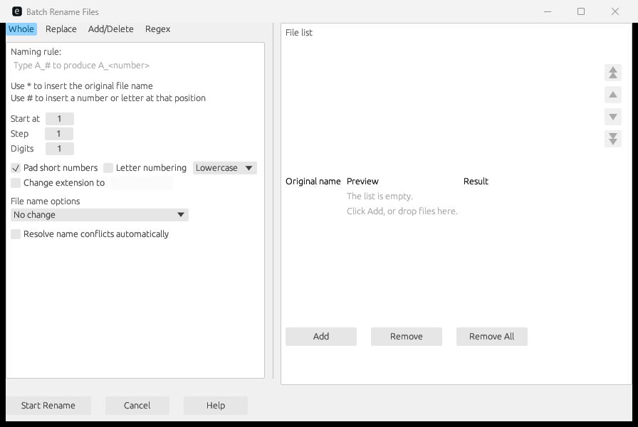

# Hrename

Hrename is a batch file rename tool for Windows. The backend is Go, the
window is a Wails webview, and the front end is plain HTML, CSS, and
JavaScript. You add files to a list, pick one rename rule, and see the new
name of each file before you apply it.



## Rules

The tool has four rule pages:

- Whole. Build a new name from a template. `*` inserts the original name.
  `#` inserts a serial number. You set the start value, the step, the digit
  count, zero padding, and letter numbering (`a, b, c` instead of `1, 2, 3`).
- Replace. Replace one string in the file name with another string.
- Add or delete. Add a prefix, add a suffix, insert text at a position, delete
  a string, or delete a range of characters.
- Regex. Replace a regular expression match. The replacement can use `$1` and
  `${name}` capture group references. The tool checks the expression as you
  type and shows errors in red.

Each page can change the case of the name, the extension, or both. When a new
name already exists, you pick one policy: ask, overwrite, skip, or rename the
new file automatically.

## Build

You need Go and the Wails CLI:

```
go install github.com/wailsapp/wails/v2/cmd/wails@latest
wails build
```

The executable is `build/bin/hrename.exe`. The front end needs no npm install
and no bundler. Wails embeds `frontend/src` straight into the binary.

## Test

The engine tests are fast because they do not build the GUI.

```
go test ./internal/rename
```

## Layout

- `internal/rename` — the rename engine, pure logic, no file system access.
- `app.go` — the bound state between the engine and the page.
- `frontend/src` — the HTML, CSS, and JavaScript of the window.

## License

MIT. See `LICENSE`.
